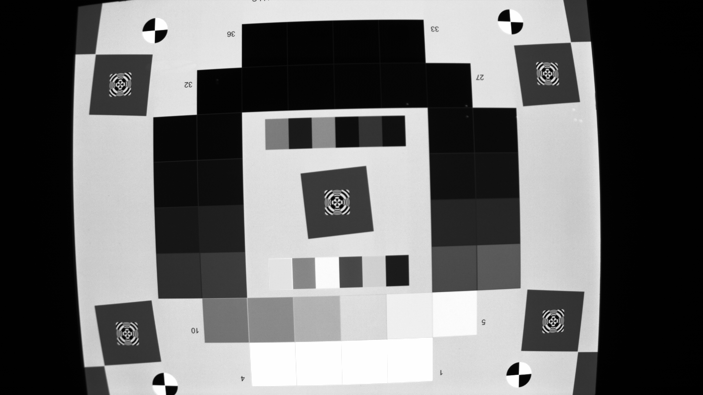

# ISPLab
An open-source image signal processing (ISP) pipeline implemented by C++

## Introduction
ISPLab is an open-source and platform-free ISP pipeline converting 10-bit RAW data to 8-bit RGB/YUV image without any 3rdparty libs (If you want to show the result and use deep learning, then OpenCV is required). 

## Result
| Raw input | RGB output |
|-----------|------------|
|||

## Methods
The pipeline of ISPLab includes following methods:
- RAW data processing
    - Dead pixel correction (DPC)
    - Black level correction (BLC)
    - Lens shading correction (LSC)
    - Anti-aliasing filtering (AAF)
    - Auto white balance (AWB)
    - Chroma noise filtering (CNF)
- Demosaicing
- RGB image processing
    - Color correction (CCM)
    - Gamma correction (GC)
- Color space convertion
- YUV image processing
    - Noise reduction (NR)
    - Edge enhancement (EE)
    - Hue & saturatiton control (HSC)
    - Brightness & contrast control (BCC)

You can easily change the parameters of different methods in the config.csv, or change the Config.cpp file.

Contact me: liuyuqing@mail.dlut.edu.cn
